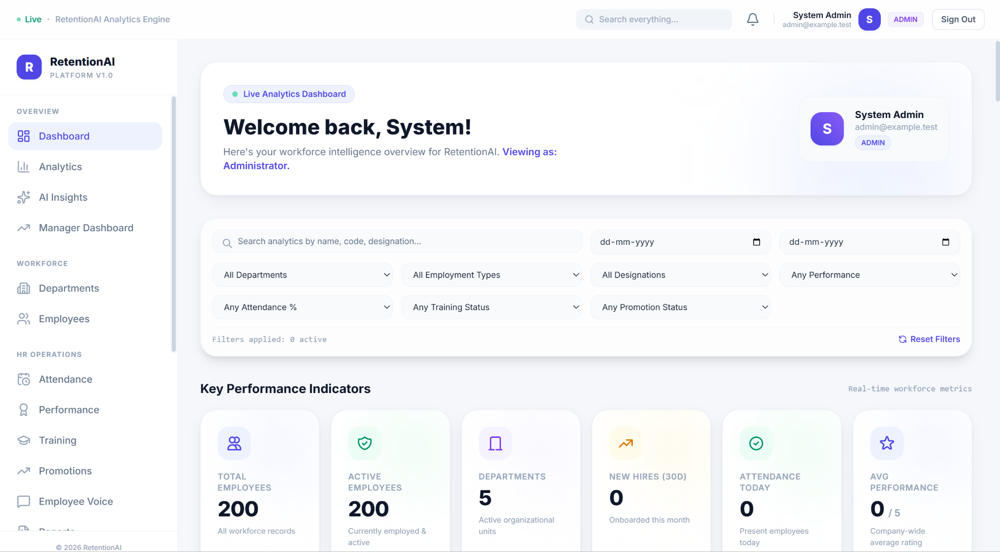
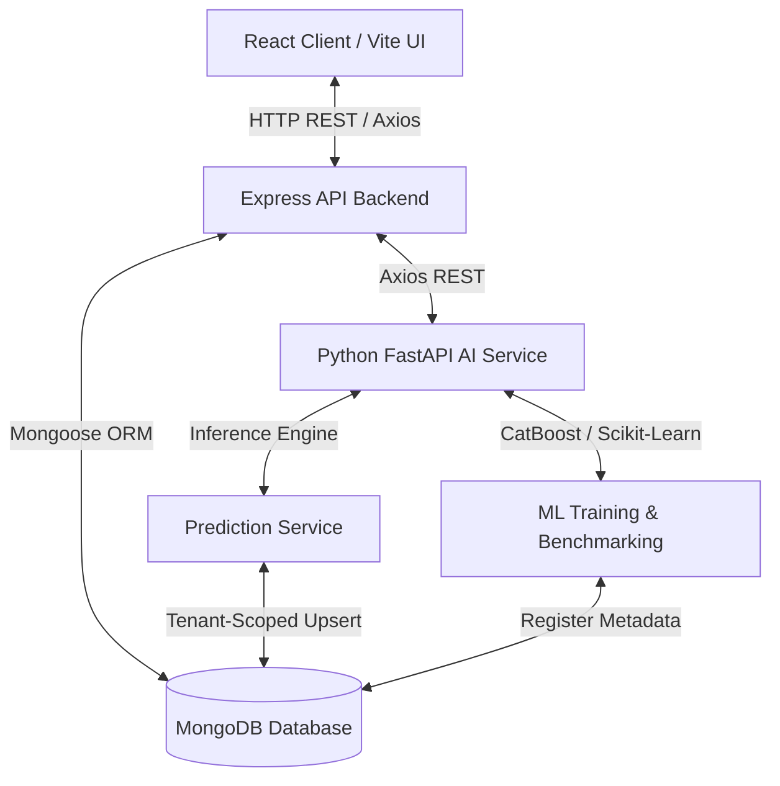

# RetentionAI

> AI-powered workforce intelligence and employee retention platform combining machine learning, workforce analytics, explainability, and enterprise multi-tenant architecture.

[](https://react.dev/)
[](https://nodejs.org/)
[](https://expressjs.com/)
[](https://www.mongodb.com/)
[](https://www.python.org/)
[](https://fastapi.tiangolo.com/)
[](https://catboost.ai/)
[](https://lightgbm.readthedocs.io/)
[](https://xgboost.readthedocs.io/)
[](https://scikit-learn.org/)
[](https://jwt.io/)
[](#multi-tenant-architecture)

---

## Platform Preview

<p align="center">
  
</p>

<p align="center">
  <em>RetentionAI Workforce Analytics Dashboard</em>
</p>

---

## Overview

RetentionAI is an enterprise workforce intelligence platform designed to systematically solve unexpected employee turnover. Unplanned attrition disrupts operations, delays strategic deliverables, and imposes significant re-hiring and training expenses. Traditional Human Resource Management Systems (HRMS) operate reactively, summarizing turnover data long after exit interviews take place. RetentionAI transforms workforce management by predicting individual attrition risk, delivering real-time organizational analytics, and surfacing high-risk personnel for timely manager intervention.

The platform's full-stack architecture bridges a React frontend, a Node.js/Express API gateway, a MongoDB database, and a Python FastAPI machine learning service. Core operational HR modules—including employee profiles, department hierarchies, attendance logs, performance evaluations, training programs, promotion tracking, and sentiment feedback—are unified into a single data repository. Automated ML training pipelines evaluate active employee indicators across 5 distinct algorithm families, employing 5-fold cross-validation to select the optimal model based on Precision-Recall AUC (PR-AUC) benchmarking.

Engineered with enterprise multi-tenancy at its foundation, RetentionAI enforces strict `organizationId` isolation across all database queries, background predictions, and executive dashboard visualizations. Predictive inference is updated idempotently using composite indexing, deactivated or deleted employee records are excluded from active metrics, and heavy AI training operations are protected by concurrency locks. RetentionAI delivers a secure, scalable solution that turns raw workforce data into actionable retention strategies.

---

## Problem & Solution

### Problem

- **Proactive Risk Identification**: HR leadership struggles to identify which high-value employees are at risk of leaving before a resignation is submitted.
- **Fragmented HR Repositories**: Employee demographics, attendance, performance reviews, and compensation data exist in disconnected silos.
- **Manual CSV Ingestion Errors**: Bulk workforce uploads fail frequently due to rigid schemas, header variations, and unmapped departments.
- **Data Isolation Risks**: Multi-tenant systems risk cross-tenant data leaks, synthetic prediction pollution, or showing metrics for soft-deleted personnel.
- **Unclear ML Outputs**: Raw prediction probabilities lack clear operational context, making it hard to prioritize intervention efforts.

### Solution

| Challenge | RetentionAI Solution |
| :--- | :--- |
| **Proactive Risk Scoring** | Automated ML pipeline calculates individual attrition risk probabilities and risk tiers (`HIGH`, `MEDIUM`, `LOW`). |
| **Unified Workforce Hub** | Integrates employee profiles, departments, attendance, performance, training, promotions, and feedback. |
| **Universal CSV Import** | Ingests enterprise CSVs with flexible header aliases and auto-creates missing departments within tenant scope. |
| **Strict Multi-Tenancy** | Service-level `organizationId` filtering ensures predictions and metrics belong strictly to active tenant employees. |
| **Actionable Prioritization** | Surfaces Top 10 High-Risk Employees alongside model comparison metrics (PR-AUC CV, F1, ROC-AUC, Accuracy). |

---

## Core Features

### Workforce Management
- **Employee Lifecycle Tracking**: Complete management of active, inactive, and historical employee profiles.
- **Department Administration**: Dynamic department hierarchies, staffing metrics, and managerial scope assignment.
- **Operational HR Modules**: Integrated tracking for Attendance, Performance reviews, Training completion, Promotion readiness, and Employee Feedback.

### Workforce Analytics
- **Executive Dashboard**: Real-time operational KPIs including Total Employees, Active Employees, Departments, New Hires, Attendance Today, and Average Performance.
- **Multi-Parametric Filtering**: Search and filter workforce records by department, status, employment type, designation, performance, attendance, training status, and promotion readiness.
- **Visual Analytics**: Interactive distribution charts covering gender balance, employment type, experience tiers, and monthly hiring vs. attrition trends.

### AI-Powered Attrition Prediction
- **Risk Classification**: Probability scoring categorized into `HIGH`, `MEDIUM`, and `LOW` risk tiers.
- **Model Comparison Engine**: 5-fold cross-validation benchmarking across CatBoost, LightGBM, XGBoost, Random Forest, and Logistic Regression.
- **Top 10 High-Risk Roster**: Prioritized list of high-risk active employees for immediate HR intervention.
- **Prediction Coverage**: Reports `(Predicted: X | Pending: Y)` counts to reflect workforce inference status accurately.

### Universal Data Import
- **Flexible Header Matching**: Ingests enterprise CSV files by resolving aliases (`Employee_ID`, `EmpCode`, `Dept`, `Department_Name`).
- **Department Auto-Creation**: Auto-creates missing referenced departments on-the-fly within current organization scope.
- **Governance & Idempotency**: Prevents record duplication during re-imports while capturing line-by-line validation errors.

### Multi-Tenant Architecture
- **Organization Scoping**: All database routes, aggregations, and prediction records are scoped by `organizationId`.
- **Soft-Deletion Exclusion**: Automatically filters soft-deleted personnel (`isDeleted: false`) from risk statistics.
- **Composite Upsert Keys**: Predictions use composite indexing `{"organizationId": org_oid, "employeeId": employee_oid}`.

---

## AI / ML Pipeline

RetentionAI implements an end-to-end machine learning pipeline tailored for tabular workforce datasets:

```text
Data Ingestion
    ↓
Data Validation & Preprocessing
    ↓
Feature Preparation
    ↓
5-Fold Cross Validation
    ↓
Model Benchmarking
    ↓
PR-AUC Based Model Selection
    ↓
Risk Prediction
    ↓
High / Medium / Low Risk Classification
    ↓
Dashboard Insights
```

- **Preprocessing & Feature Preparation**: Missing values are imputed, categorical variables are encoded, and engineered features (tenure, attendance ratio, performance trend, feedback sentiment) are computed.
- **5-Fold Cross-Validation**: Candidate model families are trained and cross-validated on identical data folds.
- **PR-AUC Benchmarking**: Precision-Recall AUC (PR-AUC) mean and standard error metrics are calculated and registered in MongoDB `modelMetadata`.
- **Tenant-Scoped Inference**: The top-performing algorithm executes batch prediction, storing results with explicit tenant organization mapping.

---

## Model Benchmarking

Workforce attrition datasets inherently exhibit class imbalance, as the majority of employees remain active. RetentionAI uses 5-fold cross-validated **Precision-Recall AUC (PR-AUC)** as its primary model selection metric.

| Model Family | PR-AUC (CV) | F1 Score | ROC-AUC | Accuracy | Train Time |
| :--- | :--- | :--- | :--- | :--- | :--- |
| **CatBoost Classifier** | *Generated during training* | *Generated during training* | *Generated during training* | *Generated during training* | *Generated during training* |
| **LightGBM Classifier** | *Generated during training* | *Generated during training* | *Generated during training* | *Generated during training* | *Generated during training* |
| **XGBoost Classifier** | *Generated during training* | *Generated during training* | *Generated during training* | *Generated during training* | *Generated during training* |
| **Random Forest** | *Generated during training* | *Generated during training* | *Generated during training* | *Generated during training* | *Generated during training* |
| **Logistic Regression** | *Generated during training* | *Generated during training* | *Generated during training* | *Generated during training* | *Generated during training* |

> [!NOTE]
> All metrics are dynamically computed and stored in MongoDB `modelMetadata` during model execution.

---

## Attrition Risk Overview

The Attrition Risk Overview section provides a mathematical and operational snapshot of workforce turnover risk:

- **Risk Tiers**: `HIGH` risk, `MEDIUM` risk, and `LOW` risk groupings.
- **Status Metrics**: Total Active Employees, Predicted Employees, and Pending Predictions.
- **Consistency Verification Rules**:
  $$\text{High Risk} + \text{Medium Risk} + \text{Low Risk} = \text{Predicted Employees}$$
  $$\text{Predicted Employees} + \text{Pending Predictions} = \text{Total Active Employees}$$
- **Data Integrity**: Dashboard metrics strictly query active employee IDs (`isDeleted: false`) belonging to the authenticated organization, excluding orphan, synthetic, or cross-tenant records.

---

## Universal Employee Data Import

The Universal Data Import system handles heterogeneous enterprise CSV formats through automatic header resolution and department provisioning:

```text
CSV Upload → Header Normalization → Field Mapping → Department Resolution → Tenant Auto-Creation → Validation → Idempotent Upsert
```

### Supported Column Aliases
- **Employee Code**: `employeeCode`, `EmployeeCode`, `Employee_ID`, `EmpCode`, `id`, `ID`
- **First Name**: `firstName`, `FirstName`, `First_Name`
- **Last Name**: `lastName`, `LastName`, `Last_Name`
- **Email**: `email`, `Email_Address`, `Work_Email`
- **Designation**: `designation`, `Designation`, `JobRole`, `Position`
- **Department**: `department`, `Department`, `departmentName`, `DepartmentName`, `departmentCode`, `Dept`, `Dept_Name`
- **Salary**: `salary`, `Salary`, `MonthlySalaryINR`, `monthlySalaryINR`, `MonthlySalary`
- **Joining Date**: `joiningDate`, `Joining_Date`, `HireDate`, `hireDate`
- **Location**: `workLocation`, `WorkLocation`, `Location`, `location`

### Governance & Race-Condition Protection
- **Normalization**: Department strings are trimmed and matched using case-insensitive lookup.
- **Tenant-Scoped Provisioning**: Unrecognized departments are automatically created within the authenticated organization.
- **Concurrency Safeguards**: In-memory caching prevents duplicate department creation when processing concurrent rows.

---

## Multi-Tenant Architecture

```text
Authenticated User
       ↓
JWT Authentication
       ↓
Organization Context (organizationId)
       ↓
Express API Controllers & Services
       ↓
Active Employee Query (isDeleted: false)
       ↓
MongoDB Aggregation Pipeline
```

Data isolation is guaranteed through service-layer enforcement:
- All database queries filter explicitly by `organizationId`.
- Risk aggregations validate employee existence against active employee lists.
- Prediction updates use composite filters `{"organizationId": org_oid, "employeeId": employee_oid}`.
- Cross-tenant prediction sharing is strictly prevented.

---

## Security & Access Control

- **JWT Authentication**: Signed access and refresh tokens for secure session management.
- **Role-Based Access Control (RBAC)**: Role checks (`SUPER_ADMIN`, `ADMIN`, `MANAGER`, `EMPLOYEE`) enforce endpoint access rules.
- **Soft Deletion**: Entity schemas utilize soft-deletion flags (`isDeleted: true`) for historical audit safety.
- **Concurrency Protections**: Redis-backed and memory-backed concurrency slots prevent server saturation during heavy AI batch jobs.
- **Environment Isolation**: Secrets, database URIs, and JWT credentials are configured strictly via environment variables.

---

## System Architecture



---

## Repository Structure

```text
RetentionAI/
├── client/                     # React 18 + Vite Frontend
│   ├── src/
│   │   ├── components/         # Reusable UI components & charts
│   │   ├── pages/              # Dashboard, Employees, Analytics pages
│   │   ├── store/              # Redux Toolkit state slices
│   │   └── services/           # Axios API services
│   ├── package.json
│   └── vite.config.js
│
├── server/                     # Node.js + Express API Backend
│   ├── src/
│   │   ├── controllers/        # Express route controllers
│   │   ├── middleware/         # Auth, RBAC, rate-limiting, validation
│   │   ├── models/             # Mongoose schemas (Employee, Department, Prediction)
│   │   ├── routes/             # REST API endpoint definitions
│   │   ├── services/           # Business logic & AI orchestration
│   │   └── utils/              # AI concurrency gate & utilities
│   ├── tests/                  # Integration & consistency test suites
│   └── package.json
│
├── ai-service/                 # Python FastAPI AI/ML Service
│   ├── app/
│   │   ├── main.py             # FastAPI service entry point
│   │   ├── prediction/         # Prediction engine
│   │   └── training/           # Model trainer & benchmark engine
│   ├── requirements.txt        # Python dependencies
│   └── train_model.py          # Model training execution script
│
├── docs/                       # Architectural guides & media assets
│   └── images/                 # Documentation screenshots
│       └── retentionai-dashboard.png
│
├── docker-compose.yml          # Container stack orchestration
└── README.md                   # Repository documentation
```

---

## Tech Stack

| Layer | Technologies |
| :--- | :--- |
| **Frontend** | React 18, JavaScript (ES6+), Vite, Redux Toolkit, TailwindCSS, Recharts, Lucide Icons |
| **Backend API** | Node.js, Express.js, Mongoose ORM, JWT, Winston, Upstash Redis / Memory Lock |
| **Database** | MongoDB / MongoDB Atlas |
| **AI / ML Service** | Python 3.11, FastAPI, Uvicorn, CatBoost, LightGBM, XGBoost, Scikit-Learn |
| **DevOps & Infrastructure** | Docker, Docker Compose, GitHub Actions CI |
| **Testing** | Node.js Native Test Runner (`node --test`) |

---

## Getting Started

### Prerequisites
- **Node.js**: v20.0.0 or higher
- **npm**: v10.0.0 or higher
- **Python**: v3.11 or higher
- **MongoDB**: Local MongoDB server or MongoDB Atlas URI

### Environment Variables Setup

Create a `.env` file in the `server`, `ai-service`, and `client` directories using `.env.example`:

```bash
# Server Environment (.env)
PORT=5000
MONGODB_URI=<your-mongodb-uri>
MONGODB_DB_NAME=retentionai
JWT_ACCESS_SECRET=<your-jwt-access-secret>
JWT_REFRESH_SECRET=<your-jwt-refresh-secret>
AI_SERVICE_URL=http://localhost:8000

# AI Service Environment (.env)
MONGODB_URI=<your-mongodb-uri>
MONGODB_DB_NAME=retentionai
PORT=8000

# Client Environment (.env)
VITE_API_BASE_URL=http://localhost:5000/api/v1
```

### Installation & Execution

#### Option 1: Docker Compose (Recommended)
```bash
cp .env.example .env
docker compose up -d --build
```
- **Frontend Dashboard**: `http://localhost`
- **Express API**: `http://localhost:5000/api/v1`
- **FastAPI AI Docs**: `http://localhost:8000/docs`

#### Option 2: Local Manual Execution

```bash
# 1. Express Backend Service
cd server
npm install
npm run dev

# 2. FastAPI AI Service (Separate Terminal)
cd ai-service
python -m venv .venv
# Activate Virtual Environment:
# Windows: .venv\Scripts\Activate.ps1
# Linux/macOS: source .venv/bin/activate
pip install -r requirements.txt
uvicorn app.main:app --reload --port 8000

# 3. React Frontend Client (Separate Terminal)
cd client
npm install
npm run dev
```

---

## Testing

The project includes an integration and regression test suite powered by the Node.js native test runner:

### 1. AI Insights Consistency & Multi-Tenant Isolation
File: [`server/tests/aiInsightsConsistency.test.js`](./server/tests/aiInsightsConsistency.test.js)
- **Scenario A**: Active employee scoping (200-employee population validation).
- **Scenario B**: Multi-tenant isolation (Org A vs. Org B prediction separation).
- **Scenario C**: Exclusion of synthetic/orphan predictions lacking active employee records.
- **Scenario D**: Soft-deleted/deactivated employee prediction exclusion.
- **Scenario E**: Prediction upsert idempotency verification.
- **Scenario F**: Employee population replacement/re-import validation.
- **Scenario G**: Top 10 High-Risk employee populated field validity and max 10 constraints.
- **Scenario H**: Mathematical count consistency (`high + medium + low === predictedCount`) and zero-employee edge case handling.

### 2. Department Import & Auto-Creation Regression
File: [`server/tests/employeeImportDepartmentAutoCreate.test.js`](./server/tests/employeeImportDepartmentAutoCreate.test.js)
- Scenarios A–G verifying missing department auto-creation, case-insensitive normalization, and tenant isolation during bulk CSV imports.

### 3. Employee Management Lifecycle & RBAC
File: [`server/tests/employee.integration.test.js`](./server/tests/employee.integration.test.js)
- Validates full employee lifecycle management, CSV bulk imports, and RBAC department scope checks.

### Running Test Suites

```bash
export AUTH_TEST_MONGODB_URI="mongodb://localhost:27017/retentionai_test"

# Run AI Insights & Multi-Tenant Consistency Test Suite
cd server && node --test tests/aiInsightsConsistency.test.js

# Run Department Auto-Creation Import Test Suite
cd server && node --test tests/employeeImportDepartmentAutoCreate.test.js

# Run Employee Management Lifecycle Suite
cd server && node --test tests/employee.integration.test.js
```

---

## Engineering Highlights

- **Service-Level Multi-Tenancy**: Data isolation enforced at the API service layer rather than relying on client-side filtering.
- **Idempotent Prediction Upserts**: Enforces composite keys `{"organizationId": org_oid, "employeeId": employee_oid}` to prevent duplicate records.
- **5-Fold Cross-Validated PR-AUC**: Model benchmarking evaluates PR-AUC mean and standard error on class-imbalanced workforce data.
- **Universal Header Alias Resolution**: Flexible CSV parser maps diverse enterprise column naming conventions automatically.
- **Tenant-Scoped Auto-Provisioning**: Auto-creates missing departments on CSV import within tenant scope without race conditions.
- **AI Pipeline Concurrency Controls**: Lock management prevents server saturation during heavy AI model training jobs.
- **Native Test Runner Suite**: Automated integration testing verifying tenant isolation and mathematical count consistency.

---

## Project Status

The RetentionAI platform implementation has been verified through automated integration testing. All core services - Express backend, Python FastAPI ML pipeline, React UI, CSV ingestion engine, and tenant isolation mechanisms - are fully operational and tested.

---

## Author

**Tanya Verma**  
B.Tech Computer Science & Engineering  
Thapar Institute of Engineering & Technology  
[GitHub Profile](https://github.com/tanyaverma20)
