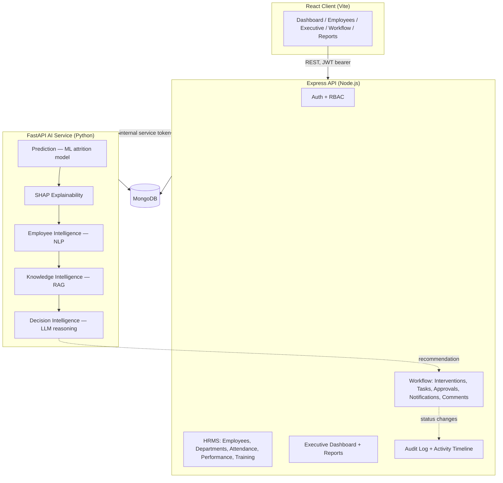

# RetentionAI — Architecture

## System diagram

## Data flow: how a recommendation becomes an HR action

1. **Prediction** — `ai-service` scores an employee's attrition risk from HR
   record features (a trained LightGBM model, `models/active/`).
2. **SHAP** — explains *why*: per-feature contribution to that risk score.
3. **Employee Intelligence (NLP)** — sentiment/burnout/emotion/topic analysis
   over free-text HR data (surveys, feedback, manager notes).
4. **Knowledge Intelligence (RAG)** — retrieves relevant HR policy passages
   from a ChromaDB vector store built from uploaded policy documents.
5. **Decision Intelligence** — an LLM (Groq) reasons over 1-4 above to
   produce a structured `Decision` (recommendation type, priority, evidence,
   recommended actions) — stored in MongoDB, insert-per-generation (full
   history preserved, never overwritten).
6. **Workflow** — an HR user turns a `Decision` into an `Intervention`
   (`POST /interventions/from-decision`), which then moves through a
   configurable approval chain (HR Manager → HR Director → CHRO, scaled by
   priority) and a lifecycle (Draft → Pending Approval → Approved → Assigned
   → In Progress → Completed), spawning `Task`s, `Notification`s, `Comment`s,
   and `Attachment`s along the way — every step audit-logged.
7. **Executive Dashboard** — a pure read/rollup layer over steps 1-6's
   already-computed outputs (company health score, risk heatmap, ROI
   analytics, forecasts) — it performs zero new AI computation.

## Service responsibilities

| Service | Owns | Never does |
|---|---|---|
| `client` | UI, client-side routing/RBAC gating, chart rendering | Business logic, direct DB access |
| `server` | Auth/RBAC, all persistence (HRMS + workflow + audit), orchestrates calls to `ai-service` | ML/NLP/RAG computation |
| `ai-service` | Prediction, SHAP, NLP, RAG, decision reasoning | User accounts, RBAC, workflow state |
| `mongo` | All persistent state for both `server` and `ai-service` | — |

## Key architectural decisions

- **FastAPI computes, Express persists.** `ai-service` returns raw computed
  results; `server` is the only writer of record for anything user-facing
  (predictions, decisions, workflow state), keeping one consistent
  audit/RBAC boundary.
- **Insert-per-generation, not upsert**, for `Explanation`, `Decision`,
  `EmployeeIntelligence`, and `PredictionHistory` — every generation is kept,
  so trend/history views (e.g. the Executive Dashboard's risk trend) have
  real data to plot. `Prediction` itself is the deliberate exception
  (upserted — only the latest score per employee is operationally relevant).
- **Single-tenant now, multi-tenant-shaped.** Every collection carries an
  `organizationId`, and every controller resolves it via a
  `x-organization-id` header with a fallback default — real multi-tenancy
  would mean enforcing that header rather than defaulting it, not a schema change.
- **In-process metrics/rolling-window latency tracking** (Part 4/9), not
  Prometheus — appropriate for a single-instance deployment; documented as
  the first thing to replace when scaling beyond one instance per service.
