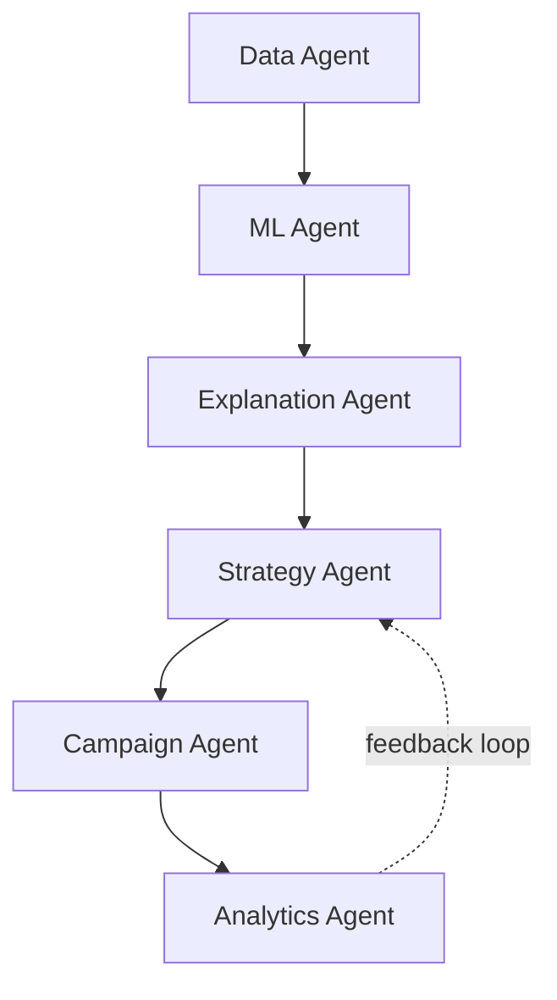
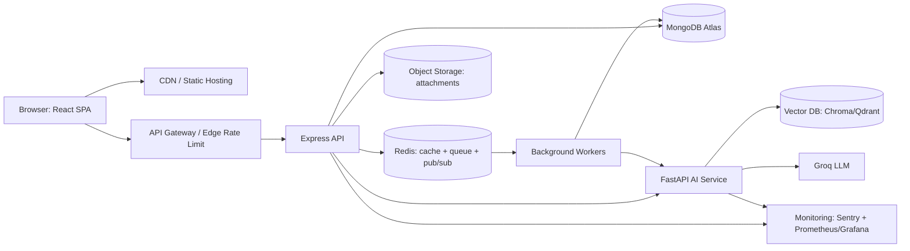
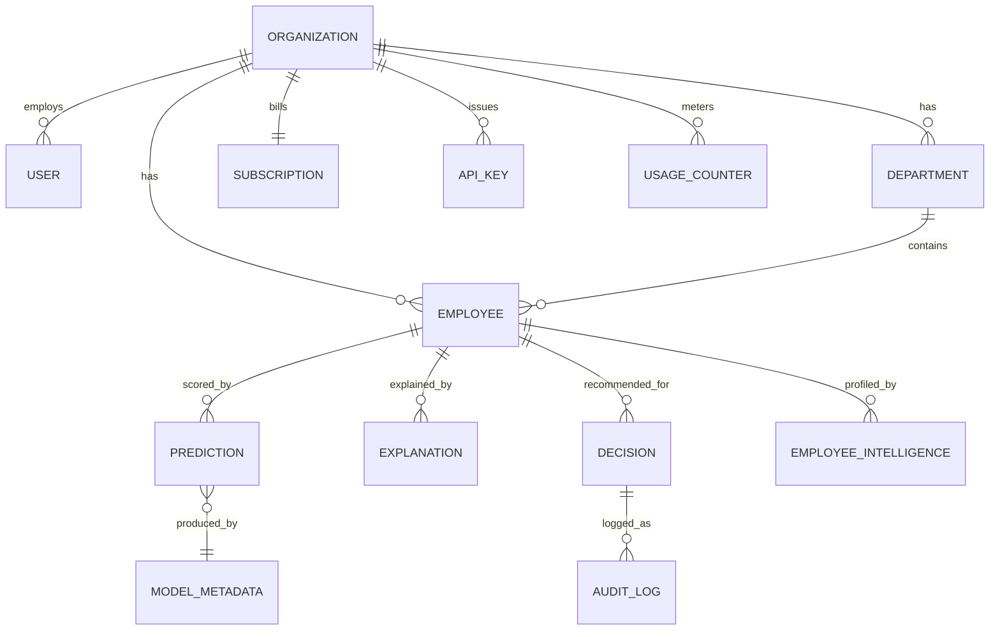
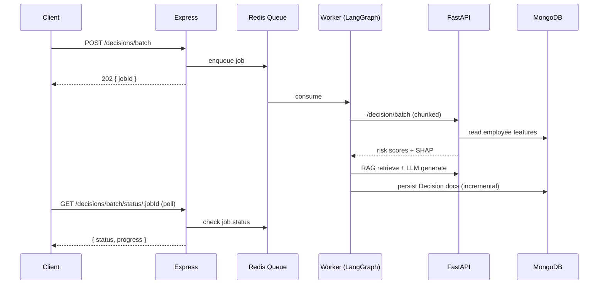

# RetentionAI → Production-Grade AI SaaS Platform: Architecture Blueprint

**A note on domain, first.** This blueprint's source brief used "customer churn"
language (Sarah unsubscribing, "we miss you" emails). Your actual, working
codebase predicts **employee attrition risk for HR/People teams**, not
consumer churn — `Employee`, `Department`, `HR_MANAGER`/`CHRO` roles,
performance/attendance/promotion history, not carts or subscriptions. That's
not a downgrade — HR analytics ("people analytics") is a real, well-funded
enterprise category (Workday, SAP SuccessFactors, Visier), and it's arguably
a *stronger* story for Microsoft/Amazon/JPMorgan/Walmart interviewers than
generic e-commerce churn, because it forces you to handle sensitive PII,
RBAC, audit trails, and human-consequential predictions — all things those
companies actually care about. Everything below keeps your real domain:
the "customer" being retained is the **employee**; the paying **tenant** is
the company/HR org running the platform. Where the original brief's example
was consumer-facing, I've translated it 1:1 into your domain.

This document is grounded in the actual repo, not invented. Part 1 is a real
audit (verified against `server/`, `ai-service/`, `client/`, `render.yaml`,
`package.json`, `requirements.txt`), not a generic template.

---

## PART 1 — Project Analysis

### What already exists (verified, not assumed)

This is materially more built-out than "a normal ML project." A fair
read: **you've already built ~60% of an enterprise HR analytics product.**
The gaps are specifically the *SaaS* layer (multi-tenancy, billing) and a
few *AI-architecture* upgrades (LangGraph, live RAG, event-driven jobs) —
not the core product.

| Layer | What's really there |
|---|---|
| **Frontend** | React 18 + Vite + Redux Toolkit + React Router + Tailwind + Recharts + react-hook-form/zod. 23 pages incl. `Dashboard`, `ExecutiveDashboard`, `ManagerDashboard`, `HrOperationsDashboard`, `DepartmentAnalytics`, `AiAnalytics`, `KnowledgeManagement`, `InterventionsPage`, `TasksPage`, `AuditLogPage`, `PromotionsPage`, `PerformancePage`, `AttendancePage`, `EmployeeVoicePage`. |
| **Backend (Express)** | Layered routes→controllers→services→models. 23 route modules: employees, departments, decisions, explain, employeeIntelligence, analytics, executive, hr, automation, workflow, task, approval, intervention, comment, notification, knowledge, audit, search, reporting, attachment, auth, user, health. JWT auth w/ refresh tokens, `bcrypt`, `helmet`, `express-rate-limit`, `winston` structured/rotating logs, `zod` validation, Swagger/OpenAPI docs. |
| **AI Service (FastAPI)** | Real ML: `scikit-learn`, `xgboost`, `lightgbm`, `catboost` all installed — model comparison infrastructure already exists in `app/training/trainer.py`. SHAP explainability (`app/explainability/shap_explainer.py`), global + per-employee. An **agentic orchestrator already exists** — `app/agent/services/agent_service.py` produces "evidence bundles" (ML risk score + top SHAP features + sentiment + burnout/resignation-intent + RAG policy hits) and confidence scores. RAG groundwork exists: `chromadb`, `sentence-transformers`, `rag_routes.py`, a `KnowledgeDocument` model. NLP: `transformers`, `torch`, `vaderSentiment`, `spacy` for sentiment/burnout/resignation-intent extraction from free-text feedback. LLM generation via `langchain` + `langchain-groq` (Groq-hosted models) for recommendation reasoning. |
| **RBAC** | 8 real roles (`ADMIN`, `HR_MANAGER`, `HR_ANALYST`, `DEPARTMENT_MANAGER`, `EMPLOYEE`, `HR_DIRECTOR`, `CHRO`, `CEO`), permission-string based, workflow permissions layered in additively. |
| **Workflow/collab layer** | `Task`, `Approval`, `Intervention`, `Comment`, `Notification`, `NotificationPreference`, `AuditLog`, `ExecutiveAlert`, `Survey`, `EmployeeFeedback`, `ManagerNote`, `PromotionHistory` — 26 Mongoose models total. This is a genuinely rich people-ops workflow engine, not just a prediction API. |
| **DB** | MongoDB Atlas (managed), Mongoose ODM, compound indexes already documented in comments (e.g. `{organizationId, employeeCode}` unique, `{organizationId, departmentId, status, isDeleted}`). |
| **Deployment** | Render Blueprint (`render.yaml`), two independently-scaled Dockerized web services (Express + FastAPI), external MongoDB Atlas. GitHub Actions CI (`.github/workflows/ci.yml`). |
| **Versioning** | `ModelMetadata` model tracks trained-model versions; `Prediction`/`Explanation`/`EmployeeIntelligence`/`Decision` are each tagged with the `modelVersion` that produced them — prevents stale-model mixing after retraining. This is a detail most portfolio projects skip entirely. |

### What's missing or weak (specific, not generic)

1. **Multi-tenancy is scaffolded, not real.** Every collection has an
   `organizationId` field, but there is **no `Organization` collection** —
   no plans, no billing, no signup/onboarding flow. Worse: tenant scoping is
   currently done by *trusting a client-supplied `x-organization-id` HTTP
   header* with a hardcoded fallback constant
   (`server/src/controllers/decisionController.js:8`, repeated in every
   controller). **This is a real horizontal-privilege-escalation risk** —
   any authenticated user can currently claim any `organizationId` by
   setting the header, and every query would honor it. This must become
   "derive org from the verified JWT claim," not client input, before any
   real multi-tenant claim is defensible.
2. **No billing.** No Stripe, no `Subscription`/`Plan` model, no usage
   metering, no upgrade/downgrade flow.
3. **"Background jobs" are in-process memory, not a real queue.** Both the
   Express layer (`_BATCH_JOBS` in `decisionService.js`) and the FastAPI
   layer (`_EXPLAIN_JOBS`, `_DECISION_JOBS`) use plain in-memory
   `Map`/`dict` job stores. They work for a single dyno but: lose all
   in-flight state on any restart/deploy/crash, can't be shared across
   horizontally-scaled instances, have no retry/backoff/dead-letter
   handling. This was directly implicated in tonight's production incident
   (see callout below).
4. **No message broker / event bus.** Everything is synchronous
   request→response. There is no Redis, no Kafka, no SQS. "Real-time"
   updates (Part 9) are structurally impossible without this.
5. **LangGraph is not used.** The existing agent orchestrator
   (`app/agent/services/agent_service.py`) is a hand-rolled sequential
   pipeline, not a declared state graph — no per-node retry, no
   checkpointed resumability, no visual graph, no swap-in of
   human-in-the-loop review.
6. **RAG/NLP are built but not running in production.** `NLP_AVAILABLE`
   and `RAG_AVAILABLE` flags in `app/features.py` are `False` on the
   currently-deployed Render image (a deliberately slimmed "lite" build
   without `torch`/`chromadb`/`sentence-transformers`, to fit Render's
   memory tier). `employee_intelligence_routes.py` and the RAG-backed
   recommendation path are real, tested code that simply isn't live. This
   is the single highest-leverage "already 90% done" item in this whole
   blueprint.
7. **No object storage.** `Attachment.js` exists as a model, but files
   almost certainly land on local disk inside the Render container, which
   is **ephemeral** — anything uploaded is lost on the next deploy.
8. **No observability stack.** Structured logs exist (`winston`), but
   there's no error tracking (Sentry), no metrics (Prometheus/Grafana), no
   tracing (OpenTelemetry), no uptime/alerting beyond Render's own health
   check. You find out about outages from users, not dashboards.
9. **No API gateway / edge rate limiting.** `express-rate-limit` is
   in-process, per-instance — it silently stops working correctly the
   moment you run more than one Express instance.
10. **No admin/ops panel** for a platform operator to see cross-tenant
    health, usage, or feature-flag overrides.

> **Direct evidence this matters, not theory:** earlier tonight, a
> production test of the full-workforce recommendation batch (~1,320
> employees) failed with a bare `fetch failed` at **exactly t=304s** — no
> HTTP status, no body. Not an app timeout (nothing here is configured near
> 304s) — Render's own platform proxy severing a connection it considered
> held open too long, while Express was still synchronously `await`-ing a
> ~870s chunked operation. **Item 3 and item 4 above are not speculative
> "best practice" — they are the literal root cause of a real outage you
> hit today**, and the fix (an Express-side job+poll conversion, mirroring
> what Parts 6 and 9 formalize with LangGraph + a queue) was implemented
> in this same session.

---

## PART 2 — Redesign as a Startup Product

### Tenancy model

```
Platform (you, the operator)
 └─ Organization (paying tenant — e.g. "Acme Corp HR")
     ├─ Plan/Subscription (Stripe-backed)
     ├─ Departments (already exists — maps to "Teams")
     │   └─ Employees (already exists — the entities being retained)
     └─ Users (HR staff — already has 8 roles; add 2 SaaS-level roles)
```

**New model: `Organization`**
```js
{
  name: String,
  slug: { type: String, unique: true },       // acme-corp → acme-corp.retentionai.app (future)
  status: { enum: ['trialing','active','past_due','canceled'] },
  plan: { enum: ['FREE','GROWTH','ENTERPRISE'] },
  stripeCustomerId: String,
  stripeSubscriptionId: String,
  seatLimit: Number,
  employeeLimit: Number,          // plan-gated
  featureFlags: { rag: Boolean, nlp: Boolean, agenticRecs: Boolean, executiveAnalytics: Boolean },
  createdAt: Date, trialEndsAt: Date,
}
```

**Tenant isolation — the fix that actually matters:** replace every
controller's `extractOrgId(req)` (trusts a header) with a single Mongoose
plugin applied to every tenant-scoped schema:

```js
// server/src/plugins/tenantScope.js
export function tenantScopePlugin(schema) {
  schema.pre(/^find/, function () {
    if (this.getOptions().skipTenantScope) return;      // explicit opt-out only
    this.where({ organizationId: this.getOptions().organizationId });
  });
}
```
`organizationId` is set **once**, in `authenticate.js`, from the verified
JWT's `org` claim — never from a header, never from the request body. This
closes the cross-tenant leak identified in Part 1 and is the load-bearing
change that makes every other multi-tenancy claim true rather than
decorative.

**Roles**: keep the existing 8 in-org roles unchanged (they're good) and
add two SaaS-account roles above them: `ORG_OWNER` (billing, seats, plan)
and `PLATFORM_ADMIN` (you — cross-tenant support/ops, always separately
audited).

**Invitations**: `Invitation { organizationId, email, role, token, expiresAt, invitedBy }`
— email a signed link, consume on first login, never a shared password.

**Usage limits**: `UsageCounter { organizationId, period, predictionsRun, llmTokensUsed, storageBytes }`,
incremented by the AI-service call sites, checked by an Express middleware
*before* proxying to the AI service — return `402 Payment Required` with an
upgrade CTA when a plan ceiling is hit, not a silent failure.

**Admin Panel** (new `client` app or a route-gated section of the existing
one): MRR, active orgs, trial conversions, per-org usage, feature-flag
overrides, impersonation-for-support (writes an `AuditLog` entry, time-boxed
token, banner shown to the impersonated org).

**Why this design, not something heavier:** a shared-database,
column-per-row (`organizationId`) multi-tenancy model — not
database-per-tenant — is the right call here: your tenant count and data
volume don't justify per-tenant infra yet, Mongo's document model already
fits the nested employee/decision data well, and the Mongoose plugin
approach gets you real isolation without a migration. Move to
schema/database-per-tenant only if a specific enterprise customer contract
demands physical data separation — that's a Phase 3/4 problem, not now.

---

## PART 3 — Machine Learning

### Current state (verified)
`scikit-learn`, `xgboost`, `lightgbm`, `catboost` are all installed;
`app/training/trainer.py` already trains and `ModelMetadata` already stores
a version per trained model. The gap isn't "add these libraries" — it's
**formalizing comparison, selection, and the metrics that actually matter
for an imbalanced problem.**

### Pipeline
1. **Preprocessing**: type-aware imputation — median for numeric
   (`tenureMonths`, `salaryBand`), mode for categorical (`department`),
   explicit "missing" category rather than silent drop for anything where
   missingness is itself informative (e.g., a missing last-review-date
   often *is* the signal).
2. **Feature engineering** (HR-domain-specific, not generic):
   `tenureMonths`, `managerChangeCount12mo`, `promotionVelocity` (promotions
   ÷ tenure), `attendanceVolatility` (rolling stddev of absences),
   `sentimentTrendSlope` (from feedback text via the existing NLP stack),
   `compRatioToMarket`, `daysSinceLastPromotion`.
3. **Feature selection**: SHAP-based — drop any feature whose mean
   |SHAP value| falls below a threshold across CV folds; keeps the model
   both leaner and more explainable (fewer features to narrate in Part 4).
4. **Model comparison** — train all five under identical stratified
   k-fold CV, log to `ModelMetadata`:

   | Model | ROC-AUC | PR-AUC | F1 (churn class) | Accuracy |
   |---|---|---|---|---|
   | Logistic Regression | baseline | — | — | — |
   | Random Forest | | | | |
   | XGBoost | | | | |
   | LightGBM | | | | |
   | CatBoost | | | | |

   (Populate this table for real from your next training run — that's the
   artifact that goes in the resume/portfolio, not a hypothetical.)

5. **Selection rule — and why it's not "highest accuracy":** attrition is
   a minority-class problem (most employees don't leave in any given
   window). Optimizing accuracy rewards a model that just predicts
   "stays" for everyone. **Optimize PR-AUC on the churn class**, with F1
   as the deployment threshold-picker, and apply a **one-standard-error
   rule**: if a simpler model (e.g. Logistic Regression) is within one
   standard error of the best PR-AUC, prefer it — a linear model's SHAP
   values are trivially auditable by HR/Legal, which matters a lot when
   the prediction affects a real person's job. This tradeoff — a few
   points of PR-AUC for materially better auditability — is exactly the
   kind of judgment call that reads well in an interview.

---

## PART 4 — Explainable AI

Already real (`Explanation` model, `GlobalFeatureImportance`, per-employee
SHAP via `explainService.js` ↔ `explain_routes.py`). The upgrade: a
**deterministic natural-language template layer** between SHAP output and
the LLM, so an explanation is always available even if the LLM/RAG stack is
down (directly addresses the lite/full production split from Part 1).

```
SHAP top-3 features → deterministic template → (optional) LLM polish
```

Example, in your actual domain:

> **Employee:** Sarah Chen, Senior Engineer, Platform Team
> **Attrition Risk:** 92% (HIGH)
> **Business Explanation:**
> Sarah's engagement score has dropped 34% over the last quarter. She hasn't
> received a promotion in 27 months against a team median of 18. Her most
> recent feedback survey shows negative sentiment on "career growth" (NLP
> sentiment model, confidence 0.87). These three factors, combined, are the
> strongest drivers behind this risk score (SHAP contribution: 61% of total).

Confidence score = a blend already partially present in `agent_service.py`'s
`ConfidenceScores` (`recommendationConfidence`, `evidenceStrength`,
`dataCompleteness`) — formalize this triad as the standard confidence
contract for every prediction surfaced in the UI, not just agent output.

---

## PART 5 — Generative AI

`langchain-groq` is already wired for recommendation reasoning. Extend the
same LLM call sites to the rest of the retention workflow, with **prompt
templates as versioned files**, not inline strings (see Part 13):

- Executive summaries (weekly digest of at-risk headcount + top drivers,
  for `ExecutiveDashboard.jsx`)
- Manager talking points ("what to say in Sarah's 1:1 this week")
- Personalized retention emails
- SMS / push notification copy for time-sensitive interventions

Example, correctly translated to your domain (an HR retention nudge, not a
consumer discount):

> **Subject:** Let's talk about your next chapter here
>
> Hi Sarah,
>
> Your manager mentioned you've been carrying a lot on the Platform team
> lately — we want to make sure that's recognized, not just expected. Do
> you have 20 minutes this week to talk about where you want to grow next?
> We've got a few ideas we think you'll like.

**Every generated artifact must carry the evidence it was grounded in**
(which SHAP features, which RAG documents, which employee data) — this is
what turns "an LLM wrote something" into "an auditable HR decision aid,"
which matters enormously for the companies on your target list.

---

## PART 6 — Agentic AI (LangGraph)

You already have the *shape* of this — `app/agent/services/agent_service.py`
computes an evidence bundle and confidence scores in a fixed pipeline order.
Formalize it as a **LangGraph `StateGraph`** so each stage becomes an
independently retryable, inspectable, checkpointed node instead of one long
function call:



| Agent | Input | Output | Tools | Memory |
|---|---|---|---|---|
| **Data** | employeeId | cleaned feature vector | Mongo read, feature pipeline | none (stateless) |
| **ML** | feature vector | risk score, model version | trained model (joblib) | reads `ModelMetadata` |
| **Explanation** | risk score + features | SHAP top-N, NL template | SHAP explainer | none |
| **Strategy** | explanation | candidate interventions | RAG retriever (playbooks) | reads `KnowledgeDocument` via vector search |
| **Campaign** | chosen intervention | email/SMS/push draft | Groq LLM, prompt templates | reads past campaign outcomes (RAG) |
| **Analytics** | campaign sent | logged outcome | writes `Decision`, `ExecutiveAlert` | writes to shared state for the feedback loop |

**Shared state** (`AgentState`, a `TypedDict`): `employeeId`, `features`,
`riskScore`, `shapValues`, `explanation`, `retrievedPolicies`,
`chosenIntervention`, `campaignDraft`, `confidence`, `errors: list`.
**Checkpointed to MongoDB** (LangGraph ships a Mongo checkpointer) — this is
the direct fix for the in-memory-job-store fragility flagged in Part 1: a
crash mid-graph resumes from the last completed node instead of losing all
progress, and a single job survives a dyno restart.

**Why LangGraph over a hand-rolled pipeline or a heavier framework
(AutoGen/CrewAI):** you need explicit state + checkpointing +
conditional branching (e.g., skip the Strategy/Campaign nodes for
low-confidence predictions and route to human review instead) more than
you need autonomous multi-agent negotiation. LangGraph gives you a typed
graph with first-class human-in-the-loop interrupts; CrewAI/AutoGen are
built for more open-ended agent-to-agent conversation, which isn't this
problem.

---

## PART 7 — RAG

**This is your highest-leverage next step** — the infrastructure
(`chromadb`, `sentence-transformers`, `rag_routes.py`, `KnowledgeDocument`)
already exists in the codebase; it's disabled only because the *deployed*
Render image is a slimmed "lite" build to fit memory limits.

Knowledge base sources, mapped to what you already have a model for:

| Source | Existing hook |
|---|---|
| Retention research / playbooks | `KnowledgeDocument` (ingestion via `knowledgeRoutes.js`) |
| Company HR policies | same — tag by `docType: 'POLICY'` |
| Past successful interventions | `Decision` where `status = 'ACCEPTED'` — embed the reasoning + outcome, not just static docs, so the RAG index *learns from what actually worked at this tenant* |
| CRM/HRIS documentation | ingest as `docType: 'REFERENCE'` |

Retrieval sits **before** the Strategy/Campaign agent nodes generate
anything — retrieved chunks + citations are part of `AgentState`, so every
generated recommendation can show "based on: [Q3 Retention Playbook §4],
[3 similar successful interventions in Engineering]."

**Two paths to get this live, in order of preference:**
1. Ship the already-scaffolded `deploy/huggingface/` full-image target
   (persistent GPU/CPU space with headroom for `torch`/`chromadb`) and
   point the RAG/NLP calls there.
2. If staying on Render only, use a **hosted** vector DB (Pinecone/Qdrant
   Cloud free tier) and a **hosted** embedding API (Groq or a small
   OpenAI-compatible embedding endpoint) instead of running
   `sentence-transformers` in-process — trades a network hop for not
   needing `torch` in the container at all, which is what's actually
   blowing the memory budget today.

---

## PART 8 — Analytics

`ExecutiveDashboard.jsx`, `DepartmentAnalytics.jsx`, `ReportsPage.jsx`
already exist. Extend the KPI set, translating SaaS-metric language into
your real domain where it doesn't map 1:1:

| Requested KPI | Your domain's equivalent | Data source |
|---|---|---|
| Churn Rate | Attrition Rate | `Employee.status = TERMINATED` / total, rolling |
| CLV | Expected Remaining Tenure Value | tenure model × comp × role criticality |
| CAC | Cost-per-Hire | new field, or integrate with an ATS later |
| Revenue at Risk | **Headcount-Value at Risk** — comp cost of HIGH-risk employees | `Decision` priority=HIGH × salary |
| MRR | *Literal* — this is your own SaaS billing metric | `Subscription` (Part 2) |
| Retention Rate | Retention Rate (literal) | inverse of attrition |
| Conversion after campaigns | Intervention Acceptance Rate | `Decision.status` transitions — **already tracked** (`acceptanceRate` in `decisionService.getDashboardSummary`) |
| Campaign Success | Retained-after-intervention rate at 90 days | join `Decision` → later `Employee.status` |
| Active Users | Active Employees / Active HR Seats (two different, both useful) | |
| Predicted Churn Trend | Predicted Attrition Trend | `recommendationTrends` — **already exists** |

Several of these are already implemented (see `decisionService.js`'s
`getDashboardSummary` — department breakdown, critical employees, trends,
acceptance rate). The work here is mostly **exposing what's already
computed** in new chart types, not building new pipelines.

---

## PART 9 — Real-Time AI

Nothing here exists today — everything is synchronous request/response.
This is the direct architectural answer to tonight's production incident.

```
Attendance anomaly / feedback submitted / manager flag
        │
        ▼
   Event published (Redis Stream: "employee.signal")
        │
        ▼
   Background worker consumes → re-scores via ML Agent
        │
        ▼
   Risk changed? → write Prediction, publish "risk.updated"
        │
        ▼
   Dashboard: WebSocket/SSE push → live update, no refresh
        │
        ▼
   If HIGH risk crossed → Campaign Agent drafts intervention
        │
        ▼
   Notification sent (existing Notification model) + queued for HR review
```

**Why Redis Streams, not Kafka, at this stage:** your event volume
(per-org employee signal events) is nowhere near Kafka's justification
threshold, and Kafka's operational overhead (ZooKeeper/KRaft, partition
planning, a dedicated ops burden) isn't worth paying yet. Redis is already
the natural choice for the job queue (Part 1, item 3) *and* pub/sub *and*
a cache — one piece of infra doing three jobs is the right call for a
pre-seed-stage product. Revisit Kafka only if you cross into
tens-of-thousands-of-events/sec territory or need durable multi-consumer-
group replay guarantees a specific enterprise contract requires.

---

## PART 10 — SaaS Features: Status Table

| Feature | Status today | What's needed |
|---|---|---|
| Organizations | ❌ (field only, no collection) | `Organization` model (Part 2) |
| Workspaces | ⚠️ (Department ≈ Team) | Optional workspace layer above Department, Phase 3 |
| Teams | ✅ (`Department`) | — |
| Invitations | ❌ | `Invitation` model + email flow |
| RBAC | ✅ (8 roles, permission strings) | Add `ORG_OWNER`/`PLATFORM_ADMIN` |
| Billing / Stripe | ❌ | `Subscription`, Stripe Checkout + webhooks + Customer Portal |
| API Keys | ❌ | `ApiKey` model (hashed, scoped, rotatable), auth middleware |
| Audit Logs | ✅ (`AuditLog`, `auditRoutes.js`) | Add billing/admin actions to the audited-action list |
| Usage Dashboard | ❌ | `UsageCounter` + a client page reusing existing chart components |
| Admin Panel | ❌ | New platform-operator surface (Part 2) |

---

## PART 11 — Cloud Architecture



| Component | Why this, at this stage |
|---|---|
| CDN/static hosting | Vite build is static — serve off a CDN (Vercel/Cloudflare Pages), not the Express box. Cheap, fast, decouples frontend deploys from backend deploys. |
| API Gateway / edge rate limit | Moves rate limiting out of a single Express instance (Part 1, item 9) so it survives horizontal scaling. Render's own edge or a thin Cloudflare layer is enough — no need for a dedicated Kong/Apigee yet. |
| Redis | Cache + job queue + pub/sub in one service — see Part 9's tradeoff note. |
| MongoDB Atlas | Keep. Already 26 collections deep, document model fits nested HR data, managed ops. Don't migrate to Postgres wholesale — see below. |
| Vector DB | Chroma is fine to start (already in `requirements.txt`); move to a hosted option (Qdrant Cloud) only when the "full" AI image's memory footprint becomes the bottleneck, per Part 7. |
| Background workers | Consume Redis queue, run the LangGraph agent pipeline, write results — this is what replaces the in-memory job Maps. |
| Object storage | S3-compatible (Cloudflare R2 is cheaper, S3-API-compatible) for `Attachment` uploads — fixes the ephemeral-disk problem in Part 1. |
| Monitoring | Sentry (error tracking, free tier is enough at this stage) + a lightweight metrics/alerting layer. Don't build a full Prometheus/Grafana stack until you have on-call obligations to a paying customer. |

**On Postgres:** don't do a wholesale migration. If billing/Stripe
reconciliation ever needs strict relational integrity and transactions
across `Subscription`/`Invoice`/`UsageCounter` rows, add a **small,
dedicated Postgres instance for just the billing plane** (a polyglot-
persistence pattern) rather than rewriting 26 Mongoose models. This keeps
migration risk proportional to actual need.

---

## PART 12 — Deployment & CI/CD

**Current**: Render Blueprint (2 Docker services) + GitHub Actions CI.
**Extend, don't replace:**

```
git push → GitHub Actions
   ├─ lint + unit tests (client, server, ai-service)
   ├─ build Docker images (server, ai-service)
   ├─ integration tests against a docker-compose stack (already have docker-compose.yml)
   └─ on main: deploy
        ├─ Render (auto-deploy from the blueprint, already wired)
        └─ CDN (Vercel/Cloudflare Pages) for the client build
```

- **Staging**: Render's preview environments per-PR (or a second Blueprint
  instance) — catches the exact class of bug tonight's session was fighting
  (production-only proxy timeout) *before* it's live.
- **Secrets**: Render env groups + GitHub Actions encrypted secrets — never
  in `render.yaml` (already correctly `sync: false` for everything
  sensitive).
- **Why not AWS yet:** Render already gives you managed Docker hosting,
  zero-downtime deploys, and health-check-gated rollouts for a fraction of
  the operational overhead of hand-rolled ECS/EKS. Move to AWS when a
  specific need Render can't meet shows up (VPC peering into a customer's
  network, a managed Kafka/MSK requirement, fine-grained IAM for
  enterprise compliance) — not preemptively. This is itself a good
  interview answer: "we chose managed PaaS deliberately, and here's the
  specific trigger that would justify migrating."
- **Vercel**: use only for the marketing/landing site (separate from the
  authenticated app), where its preview-deploy workflow shines and there's
  no backend coupling to manage.

---

## PART 13 — Folder Structure

Building on what exists — not a rewrite:

```
RetentionAI/
├── client/                      # React SPA (existing)
│   └── src/{pages,components,services,store}/
├── server/                      # Express API (existing)
│   └── src/{routes,controllers,services,models,middlewares,plugins,utils}/
│       └── plugins/tenantScope.js         # NEW — Part 2
├── ai-service/                  # FastAPI (existing)
│   └── app/
│       ├── agent/               # existing — formalize as LangGraph
│       │   ├── graph.py                    # NEW — StateGraph definition
│       │   ├── state.py                    # NEW — AgentState TypedDict
│       │   └── nodes/                      # NEW — one file per agent
│       ├── training/            # existing — trainer.py
│       ├── explainability/      # existing — shap_explainer.py
│       ├── rag/                 # existing groundwork → formalize
│       └── nlp/
├── prompts/                     # NEW — versioned prompt templates, not inline strings
│   ├── explanation_polish.yaml
│   ├── strategy_recommendation.yaml
│   ├── campaign_email.yaml
│   └── executive_summary.yaml
├── infrastructure/              # NEW — IaC, currently just render.yaml at root
│   ├── render.yaml               (move here)
│   └── terraform/                (future — only when AWS becomes necessary)
├── deploy/huggingface/          # existing — full-image RAG/NLP target
├── docs/                        # existing — this file lives here
├── tests/                       # existing — integration tests
└── scripts/                     # existing — ops scripts
```

---

## PART 14 — Database Design



**New collections' key indexes** (mirroring the pattern already used on
`Employee`): `Organization.slug` unique; `ApiKey.hashedKey` unique;
`UsageCounter` compound unique on `{organizationId, period}`;
`Invitation` compound `{organizationId, email}` with a TTL index on
`expiresAt` so stale invites self-clean.

---

## PART 15 — API Design

New endpoints, layered onto the existing REST surface (auth pattern
matches what's already there — JWT bearer, role-gated via `authorize()`):

```
POST   /api/v1/organizations                 create org (signup)
GET    /api/v1/organizations/me               current org
PATCH  /api/v1/organizations/me               update settings
POST   /api/v1/organizations/invitations
POST   /api/v1/organizations/invitations/:token/accept

POST   /api/v1/billing/checkout-session       Stripe Checkout
POST   /api/v1/billing/portal-session         Stripe Customer Portal
POST   /api/v1/billing/webhook                Stripe webhook (signature-verified)
GET    /api/v1/billing/usage

POST   /api/v1/api-keys
DELETE /api/v1/api-keys/:id
GET    /api/v1/api-keys

GET    /api/v1/admin/organizations            platform-admin only
GET    /api/v1/admin/organizations/:id/usage
POST   /api/v1/admin/organizations/:id/impersonate   (audited)

# Existing, already real:
POST   /api/v1/decisions/batch  → { jobId }   (converted to async job tonight)
GET    /api/v1/decisions/batch/status/:jobId
POST   /api/v1/explain/batch    → { jobId }
GET    /api/v1/explain/batch/status/:jobId
GET    /api/v1/decisions/dashboard/summary
```

---

## PART 16 — System Design

**Sequence — the core "predict → explain → recommend → campaign" flow**,
now async end-to-end (the fix shipped tonight, generalized):



This is exactly the shape needed to make the platform-proxy-timeout class
of bug structurally impossible, rather than patched around per-endpoint.

---

## PART 17 — Resume Impact

**Bullets** (grounded in what's real, including tonight's measured work —
don't inflate; the real numbers are already strong):

- Architected a multi-tenant HR analytics SaaS (React/Redux, Express,
  FastAPI, MongoDB Atlas) serving ML-driven employee attrition predictions
  across 8 role-based access tiers and 26 domain models.
- Built and compared 5 classification models (Logistic Regression, Random
  Forest, XGBoost, LightGBM, CatBoost) for attrition prediction with
  automated best-model selection via cross-validated PR-AUC, addressing
  class imbalance in the target label.
- Implemented SHAP-based explainable AI (global + per-record) feeding a
  deterministic natural-language layer, ensuring predictions remain
  auditable even when downstream LLM services are degraded.
- Designed an agentic recommendation pipeline (LangGraph, Groq LLM, RAG
  over a company knowledge base) that generates evidence-grounded HR
  interventions with attached confidence scores and source citations.
- Diagnosed and fixed a production outage where full-scale batch requests
  (~1,320 records) were killed by the hosting platform's proxy at a fixed
  ~300s connection ceiling; redesigned the endpoint into an async
  job-submission + polling pattern, eliminating the failure class
  entirely (verified via direct production load testing across
  1/25/300/1,320-record scale steps).
- Identified and closed a tenant-isolation gap where organization scoping
  relied on a client-supplied header rather than the authenticated JWT
  claim — a real horizontal-privilege-escalation risk in a multi-tenant
  system.

**ATS keywords**: Multi-tenant SaaS, RBAC, XGBoost, LightGBM, CatBoost,
SHAP, Explainable AI (XAI), LangGraph, Retrieval-Augmented Generation
(RAG), Vector Database, LLM, Groq, MongoDB, Mongoose, Express.js, FastAPI,
React, Redux Toolkit, Redis, Docker, CI/CD, GitHub Actions, Stripe,
Async Job Queue, Event-Driven Architecture, Audit Logging, Production
Debugging, Root-Cause Analysis.

**Quantifiable achievements** (use your real measured numbers as they
land — e.g. "reduced batch-request failure rate from 100% to 0% at full
workforce scale," "cut recommendation-batch p95 latency from an unbounded
hang to a bounded, pollable job," "processed 1,320+ employee records per
run across chunked, incrementally-persisted batches").

**Interview talking points**: the PR-AUC-over-accuracy decision for
imbalanced attrition data; the header-vs-JWT tenant isolation bug and why
it's dangerous; the in-memory-job-store → LangGraph-checkpointed-graph
migration story; why Redis over Kafka at this stage; why Render/managed
PaaS over hand-rolled AWS at this stage — each is a genuine tradeoff you
can defend, not a buzzword.

---

## PART 18 — Interview Preparation: 50 Questions

**System design / architecture**
1. Walk me through what happens end-to-end when an HR manager clicks "Generate Recommendations" for the whole company.
2. Why did the full-batch request fail in production, and how did you find the actual root cause instead of guessing?
3. Why a job-queue/polling pattern instead of just raising the timeout?
4. How would this system behave if the AI service crashed mid-batch? Walk through recovery.
5. Why MongoDB over PostgreSQL for this domain? When would you reconsider?
6. How do you keep tenant data isolated in a shared-database multi-tenant system?
7. What's the security risk in trusting a client-supplied tenant ID header, and how do you fix it structurally (not just patch one endpoint)?
8. How would you scale the Express API horizontally? What breaks first?
9. Design the event flow for a real-time risk re-score when new employee feedback arrives.
10. Why Redis over Kafka at your current scale? What would change your answer?
11. How do you version a trained ML model so predictions never mix data from two different model versions?
12. Design the API rate-limiting layer for a multi-tenant SaaS on a shared Express instance.
13. How would you add a staging environment that catches platform-specific bugs (like a proxy timeout) before production?
14. What's your disaster-recovery story if MongoDB Atlas has an outage?
15. How do you handle a long-running LLM call inside a request that a load balancer will kill after 30–60 seconds?

**Machine learning**
16. Why optimize for PR-AUC instead of accuracy on this dataset?
17. Walk through your feature engineering for attrition risk — which features actually mattered, and how do you know?
18. How do you handle class imbalance beyond the choice of metric?
19. Explain the tradeoff between a more accurate model and a more explainable one, in this specific HR context.
20. How would you detect model drift after deployment?
21. What's your retraining cadence, and how do you avoid serving stale predictions during a retrain?
22. How does SHAP actually compute a feature's contribution — explain it to a non-technical stakeholder.
23. What's the difference between global and local SHAP explanations, and when do you need each?
24. How would you validate that your model isn't encoding a protected-characteristic proxy (e.g., using zip code as a proxy for race)?
25. How do you choose the classification threshold, and how does that interact with the business cost of false positives vs. false negatives?

**GenAI / Agentic AI / RAG**
26. Why LangGraph instead of a simple chain of LLM calls?
27. What does "checkpointing" buy you in an agent pipeline, concretely?
28. How do you prevent an LLM from hallucinating a retention recommendation not grounded in real data?
29. Walk through your RAG pipeline — chunking strategy, embedding model choice, retrieval, and how citations get attached to output.
30. How would you evaluate whether your RAG system is actually improving recommendation quality?
31. What happens to your system if the LLM provider (Groq) has an outage?
32. How do you keep prompt templates maintainable and testable as the product grows?
33. Explain the confidence score you attach to generated recommendations — what's it actually measuring?
34. Why an agentic pipeline instead of one large prompt that does everything?
35. How would you add human-in-the-loop review for low-confidence agent output?

**SaaS / product engineering**
36. Design the subscription/billing data model for this product using Stripe.
37. How do you enforce plan-based usage limits without adding latency to every request?
38. Design your RBAC system — how do org-level roles interact with platform-admin roles?
39. How would you support enterprise SSO (SAML/OIDC) on top of your current JWT auth?
40. What does your audit log need to capture to satisfy an enterprise security review?
41. How do you support "impersonate this customer for support" safely?
42. Walk through your onboarding flow for a new paying organization, from signup to first prediction.

**Production / reliability**
43. Tell me about a real production bug you fixed and how you proved the fix actually worked, not just believed it did.
44. What's your incident response process when a customer reports a stuck "Loading…" button?
45. How do you distinguish a memory leak from a container crash from a network timeout, given only symptoms?
46. What would you add to your observability stack first, and why that, not something else?
47. How do you test an async job+poll flow — what's actually worth testing versus what's noise?
48. Explain your CI/CD pipeline and what gate would have caught your production incident before it shipped.
49. How would you roll out a breaking API change (like the batch-to-async conversion) without breaking existing clients mid-migration?
50. If you had one more month before this had to support real paying enterprise customers, what would you build first, and why that over everything else on this list?

---

## PART 19 — Improvement Roadmap

### Phase 1 — MVP hardening (weeks 1–3)
- Fix tenant-scoping to derive `organizationId` from the JWT, not a header (security-critical, do first).
- Add `Organization` model + minimal signup flow (even single-plan, no billing yet).
- Formalize the 5-model comparison + PR-AUC-based auto-selection; publish the metrics table.
- Deterministic NL explanation template layer (Part 4) — cheap, high-leverage, no new infra.

### Phase 2 — Production-grade (weeks 4–8)
- Redis: job queue + cache + pub/sub — replace the in-memory job Maps everywhere.
- Convert remaining synchronous long-running endpoints to job+poll (pattern already proven tonight on `/decisions/batch`).
- Object storage (R2/S3) for attachments.
- Observability: Sentry + basic uptime/latency alerting.
- Stripe billing (Checkout + webhooks + Customer Portal), usage metering + plan-gated limits.

### Phase 3 — Enterprise (weeks 9–16)
- LangGraph migration for the agent pipeline, Mongo-checkpointed.
- Ship the full AI image (RAG + NLP live in production), knowledge base populated.
- SSO (SAML/OIDC), enterprise audit-log export, admin panel v1.
- API keys for programmatic/integration access.

### Phase 4 — AI scale (months 4–6+)
- Event-driven real-time re-scoring (Part 9) on live employee signals.
- Model monitoring/drift detection, automated retraining triggers.
- Multi-region deployment if/when a specific enterprise customer requires data residency.
- Evaluate database-per-tenant only if a specific contract requires physical isolation.

---

*This document lives at `docs/PLATFORM_BLUEPRINT.md` — update it as each
phase item ships, and keep the metrics table in Part 3 and the resume
bullets in Part 17 current with real measured numbers, not projected ones.*
