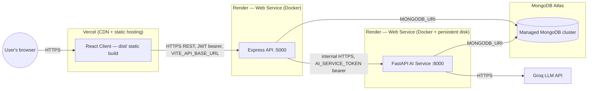

# RetentionAI — Production Deployment Guide

This is the master deployment guide. It assumes you have **not** deployed
before and walks through the recommended path end to end. Platform-specific
deep-dives (AWS EC2, Azure, DigitalOcean, a bare Docker VPS) already exist
under `docs/deployment/` for alternative infrastructure choices — this guide
covers the path recommended for this project's specific architecture.

## Recommended architecture

| Component | Platform | Why |
|---|---|---|
| **Frontend** (React/Vite, static build) | **Vercel** | The client builds to static files (`npm run build` → `dist/`) with zero server-side runtime — exactly what Vercel's CDN-first hosting is built for. Free tier is generous, and `client/vercel.json` (already created) handles the SPA rewrite React Router needs. |
| **Backend API** (Express) | **Render** | Needs a long-running Node process, not a serverless function (JWT refresh rotation, a 6-job cron scheduler, and a persistent Mongo connection pool all assume a warm process) — Render's Web Service model fits directly, and it already has a production Dockerfile. |
| **AI Service** (FastAPI) | **Render** (or **Railway** — see below) | Loads ~1-2GB of ML/NLP models into memory at startup (torch, transformers, SHAP, ChromaDB) and needs a persistent disk for the trained model file and vector store — this needs a real container with a mounted volume, not a serverless function. Render's Docker + persistent disk support handles this directly with the existing `ai-service/Dockerfile`. |
| **Database** | **MongoDB Atlas** | Already in use for local development (`server/.env`/`ai-service/.env` both point at an Atlas cluster) — no migration needed, just move from a personal free-tier cluster to a properly-sized production one if you haven't already. |

**Why not put everything on one platform?** The AI service's dependency
footprint (torch + transformers + chromadb + spacy) is an order of magnitude
heavier than the Express API's. Splitting them onto independently-scaled
services means a traffic spike on the dashboard doesn't starve the ML
pipeline of resources, and vice versa — and it matches how the two Docker
images are already built (`server/Dockerfile` is a slim ~150MB Node image;
`ai-service/Dockerfile` installs a multi-GB Python ML stack).

**Alternative for the AI service: Railway instead of Render.** If Render's
free/starter tier's cold-start time for a multi-GB container is a problem,
Railway's usage-based pricing and generally faster Docker build cache reuse
can work better for this specific service. The `ai-service/Procfile` created
alongside this guide supports either Render's Docker path or Railway's
buildpack path — pick one, you don't need both.

## Deployment topology

## Step-by-step: first-time deployment

### 0. Accounts you need

- A [Vercel](https://vercel.com) account (GitHub login works).
- A [Render](https://render.com) account (GitHub login works).
- A [MongoDB Atlas](https://www.mongodb.com/cloud/atlas) account — you likely
  already have one, since local dev already points at an Atlas cluster.
- A [Groq](https://console.groq.com) account for the `GROQ_API_KEY` (powers
  the RAG chat and the Agentic AI recommendation reasoning) — already in use
  locally, so you likely have this too.

### 1. MongoDB Atlas — confirm production readiness

If you're reusing the existing development cluster, at minimum:
1. In Atlas → **Network Access**, confirm it allows connections from Render's
   IPs — easiest is "Allow access from anywhere" (`0.0.0.0/0`) combined with
   the app-level auth already in place, or use Atlas's private endpoint
   feature for a tighter setup.
2. Confirm the cluster tier is sized for production load, not a free M0
   sandbox tier, if you expect real traffic.
3. Copy the connection string (`mongodb+srv://...`) — you'll paste it into
   both Render services' `MONGODB_URI` in step 3.

### 2. Deploy the AI Service first (Render)

The Express API depends on the AI service being reachable, so deploy it
first so you have its URL ready.

1. Push this repository to GitHub if it isn't already there.
2. In the Render dashboard: **New +** → **Blueprint**.
3. Connect your GitHub repo. Render will detect `render.yaml` at the repo
   root and propose creating **two** services (`retentionai-server` and
   `retentionai-ai-service`) — this is expected, both are defined there.
4. Before clicking "Apply", or immediately after in each service's
   **Environment** tab, fill in every variable marked `sync: false` in
   `render.yaml`:
   - `retentionai-ai-service`: `MONGODB_URI` (from step 1), `AI_SERVICE_TOKEN`
     (generate one: `openssl rand -hex 32`, or any long random string — this
     must be the **same value** on both Render services), `GROQ_API_KEY`.
5. Deploy. The AI service's Dockerfile installs a multi-GB dependency tree
   (torch/transformers/spacy) — first build can take 10-15 minutes. Watch
   the build logs for `Application startup complete` and `Uvicorn running`.
6. Once live, note its URL (e.g. `https://retentionai-ai-service.onrender.com`).
7. Hit `https://<ai-service-url>/health` — expect `{"status":"OK",...}`.
8. **Train a model before going further** — the service starts with no
   active model until one exists. From your local machine (or Render's
   Shell tab), run the training script once against the production database
   (see `docs/AI-PIPELINE.md`), or trigger it via `POST /train` once the
   Express API is also live (step 4 below covers this).

### 3. Deploy the Express API (Render)

This was already created by the Blueprint in step 2 alongside the AI
service. Fill in its remaining `sync: false` variables:
- `MONGODB_URI` — same Atlas connection string as the AI service.
- `JWT_ACCESS_SECRET` / `JWT_REFRESH_SECRET` — generate two **distinct**
  random 32+ character strings (`node -e "console.log(require('crypto').randomBytes(48).toString('hex'))"`,
  run twice). Never reuse the same value for both.
- `CORS_ORIGINS` — the exact Vercel URL you'll get in step 4, e.g.
  `https://retentionai.vercel.app`. You'll need to circle back and set this
  after step 4 gives you the real URL (Render lets you edit env vars and
  redeploy at any time).
- `AI_SERVICE_TOKEN` — must be the **identical** value you set on the AI
  service in step 2.
- `AI_SERVICE_URL` — this one is wired automatically via `fromService` in
  `render.yaml`, pointing at the AI service's internal Render hostname; you
  don't need to set it by hand.

Deploy, then confirm `https://<server-url>/health` returns `{"status":"OK"}`.

### 4. Deploy the frontend (Vercel)

1. In Vercel: **Add New** → **Project** → import this repo.
2. Vercel needs to know the client lives in a subdirectory — set **Root
   Directory** to `client` in the project's configuration screen.
3. Vercel auto-detects the Vite framework and reads `client/vercel.json`
   (already created) for the build command, output directory, and the SPA
   rewrite rule React Router needs.
4. Before deploying, add one **Environment Variable** in the Vercel project
   settings: `VITE_API_BASE_URL` = `https://<your-render-server-url>/api/v1`
   (the Express URL from step 3, with the API prefix). This is a **build-time**
   variable — Vite bakes it into the static bundle, so changing it later
   requires a redeploy, not just a settings change taking effect live.
5. Deploy. Vercel gives you a URL like `https://retentionai.vercel.app`.
6. Go back to the Render `retentionai-server` service and set `CORS_ORIGINS`
   to this exact URL (comma-separate multiple origins if you also want a
   custom domain), then redeploy that service so the new value takes effect.

### 5. Final wiring check

- Visit the Vercel URL, open DevTools → Network, and confirm API calls go to
  your Render server URL with no CORS errors in the console.
- Log in (see `docs/ADMIN-MANUAL.md` for how the demo admin account is
  seeded, or create one directly against the production database).
- From the Dashboard, click **Train Model** once to populate an initial
  model, then confirm predictions/explanations/recommendations populate.

## What this guide does NOT do

This guide was prepared without any authenticated Vercel/Render/Atlas CLI
session or cloud credentials available in the environment that prepared it —
**nothing has been automatically deployed.** Every step above requires you to
click through the actual Vercel/Render/Atlas dashboards yourself using your
own accounts.
